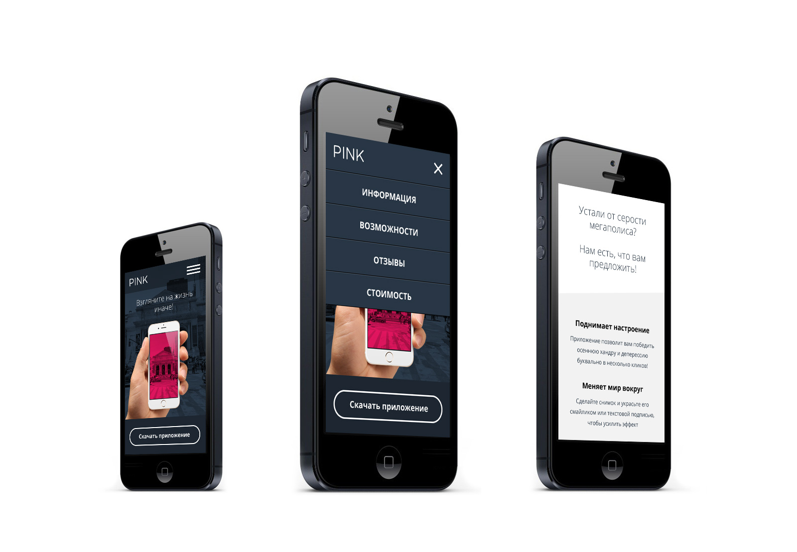

# Личный проект «Пинк» [![Build status][travis-image]][travis-url] [![Dependency status][dependency-image]][dependency-url]

<table>
  <thead>
    <tr>
      <th>Команда</th>
      <th>Результат</th>
    </tr>
  </thead>
  <tbody>
    <tr>
      <td width="22%"><code>npm i</code></td>
      <td>Установить зависимости</td>
    </tr>
    <tr>
      <td><code>npm start</code></td>
      <td>Запустить сборку, сервер и слежение за файлами</td>
    </tr>
    <tr>
      <td><code>npm start ЗАДАЧА</code></td>
      <td>Запустить задачу с названием ЗАДАЧА (список задач в <code>gulpfile.js</code>)</td>
    </tr>
  </tbody>
</table>

---

_Не удаляйте и не обращайте внимание на файлы:_ 
_`.editorconfig`, `.gitignore`, `.travis.yml`, `package.json`._
---

[travis-image]: https://travis-ci.org/webistomin/pink-adaptive.svg?branch=master
[travis-url]: https://travis-ci.org/webistomin/pink-adaptive
[dependency-image]: https://david-dm.org/webistomin/pink-adaptive/dev-status.svg?style=flat-square
[dependency-url]: https://david-dm.org/webistomin/pink-adaptive
